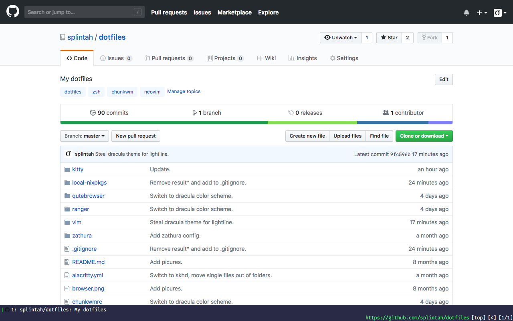
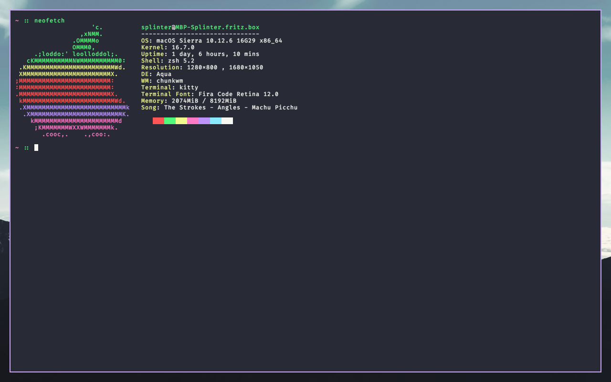

# splintah's dotfiles

## Terminal
- Theme for zsh: my own, see `zshrc`.
- Terminal emulator: [kitty](https://github.com/kovidgoyal/kitty) by [kovidgoyal](https://github.com/kovidgoyal)
- Font: [Fira Code](https://github.com/tonsky/FiraCode) by [tonsky](https://github.com/tonsky)
- Terminal theme: [Dracula](https://github.com/dracula/dracula-theme)

## Window manager
- [chunkwm](https://github.com/koekeishiya/chunkwm) by [koekeishiya](https://github.com/koekeishiya)

## Editor
- Neovim
- Theme: [Dracula](https://github.com/dracula/dracula-theme)

## Browser
- [qutebrowser](https://qutebrowser.org)

## File manager
- [ranger](https://ranger.github.io)
